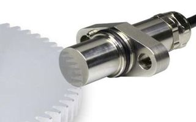

# Railway Sensor Simulator

This a [raspberry pico](https://www.raspberrypi.com/products/raspberry-pi-pico) project (based on RP2040, dual-core Arm Cortex M0+ processor).

It simulates a dual-circuit railway wheel speed sensor equipped with dual-channel (based on hall effect technology). This speed sensor is supposed to pick up motion from a toothed wheel (sometimes called a [tone wheel](https://en.wikipedia.org/wiki/Tonewheel)).

Two independent frequencies are synthesized, each on two outputs in quadrature (90° phase shift) to emulate dual-channel and inform of the *forward* or *reverse* train motion.

To drive the board, a connection to the USB virtual serial link enables to enter commands.

Simplest way get information of what is possible consists in typing: *??* (two question marks).

This project enables to deal with train speed directly when the minimum following information is set through a command to define number of teeth on the phonic wheel and its diameter.   